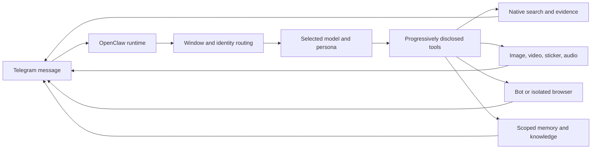

<div align="center">

# Amadeus OpenClaw Lab

**A local-first Telegram imagebot lab for OpenClaw compatibility, multimodal tools, memory, and media workflows.**

[简体中文](README.zh-CN.md) | **English**

[](https://github.com/HayOMO/amadeus-openclaw-lab/actions/workflows/ci.yml)
[](LICENSE)
[](.nvmrc)
[](docs/PATCH_COMPATIBILITY.md)
[](docs/LOCAL_OPERATOR_GUIDE.md)


</div>

> [!IMPORTANT]
> This is an **unofficial, personal integration lab**, not an OpenClaw distribution or a hosted bot service. It targets one pinned OpenClaw runtime and expects operators to provide their own local credentials.

## What It Is

Amadeus combines a governed OpenClaw compatibility layer with a plugin-first agent tooling layer. The project is built around a real Telegram group bot, but the public repository contains only reproducible code, templates, tests, and documentation.

- **Model routing:** Codex-backed GPT catalog discovery, per-window model selection, multimodal capability metadata, and DeepSeek fallback routes.
- **Search and evidence:** provider-native web search first, image search results when available, exact-source tools for Pixiv/Danbooru/reverse search, and browser escalation only when page interaction is actually needed.
- **Media workflows:** image generation and editing, sticker/GIF-to-WebM conversion, video inspection, transcription, and bounded public-video download.
- **Memory:** scoped user/group/window memory, hybrid retrieval, controlled prompt injection, and a dedicated high-reasoning curator path.
- **Telegram runtime:** per-sender conversation windows, reply continuity, persistent user model/persona choices, bounded progress updates, and deterministic control commands.
- **Browser boundary:** a dedicated logged-in bot profile plus a separate isolated profile for risky sites; the owner's ordinary browser profile is outside the tool surface.

## Architecture



The repository deliberately keeps two ownership layers visible:

| Layer | Main paths | Rule |
| --- | --- | --- |
| OpenClaw compatibility | `patches/`, `policy/runtime_patch_contract.json` | Patch only host behavior that cannot be expressed safely through public plugin/config surfaces. Every patch has verification and a retirement condition. |
| Agent tooling | `plugins/`, `tool_manuals/`, `features/`, `config/imagebot/` | Product behavior, tool contracts, memory, search, media, and interaction policy live here. |

## Quick Start

### Requirements

- Windows 11 or Windows Server
- Node.js 24 (`.nvmrc`)
- Python 3.13 for the full test suite
- OpenClaw `2026.6.10`
- Your own Telegram/OpenAI/DeepSeek/resource credentials as needed

### Install and validate

```powershell
npm ci
npm run setup:plugins
npm run setup:media
npm run verify:media
npm run build:config
npm run lint:config
```

Apply the pinned compatibility patches, then start the gateway:

```powershell
powershell -ExecutionPolicy Bypass -File .\scripts\APPLY_RUNTIME_PATCHES.ps1
.\START_IMAGEBOT_GATEWAY.cmd
```

The gateway is loopback-only by default at `127.0.0.1:18789`. Models wake on a real request; browser and memory runtimes can be prewarmed independently.

## Validation

The GitHub workflow mirrors the local Windows validation path:

```powershell
npm ci
python -m pip install -r requirements-test.txt
.\scripts\INSTALL_IMAGEBOT_PLUGIN_DEPS.ps1 -Force
npm run setup:media
npm run verify:media
npm run audit:plugins
npm run prepare:runtime:ci
npm run lint:config
npm run health:features
npm run test:all
npm run test:patches
```

CI also performs Gitleaks and TruffleHog secret scans. Actions have read-only repository permissions and do not deploy or operate a bot.

## Repository Map

| Path | Purpose |
| --- | --- |
| `plugins/` | Agent tools, memory, search, media, browser policy, and feature runtimes |
| `patches/openclaw-2026.6.10-runtime/` | Version-pinned OpenClaw compatibility patches |
| `tool_manuals/` | Progressive-disclosure tool guidance |
| `config/imagebot/` | Reproducible configuration and prompt sources |
| `features/` | Manifest-driven deterministic features |
| `policy/` | Machine-checkable architecture and patch contracts |
| `scripts/` | Setup, verification, migration, diagnostics, and tests |
| `docs/` | Architecture, security, storage, decisions, and operator guides |

Start with the [repository map](docs/REPO_MAP.md), [architecture overview](docs/IMAGEBOT_ARCHITECTURE.md), [agent architecture alignment](docs/AGENT_ARCHITECTURE_ALIGNMENT.md), and [local operator guide](docs/LOCAL_OPERATOR_GUIDE.md).

## Safety and Publication Boundary

The public export excludes or sanitizes:

- bot tokens and API credentials;
- Telegram group/operator identifiers;
- sessions, logs, memories, and generated media;
- machine-local runtime state and binaries;
- owner browser data and logged-in profile contents.

See [Security Policy](SECURITY.md), [Data Storage](docs/IMAGEBOT_DATA_STORAGE.md), and [Public Repository Plan](docs/PUBLIC_REPO_PLAN.md) before adapting this project.

## Runtime Compatibility

Compatibility patches are pinned to **OpenClaw 2026.6.10**. Updating OpenClaw without re-exporting and verifying the patch set is unsupported.

```powershell
powershell -ExecutionPolicy Bypass -File .\scripts\VERIFY_RUNTIME_PATCHES.ps1
```

Patch ownership and retirement rules are documented in [Patch Compatibility](docs/PATCH_COMPATIBILITY.md) and the [runtime patch contract](policy/runtime_patch_contract.json).

## Contributing

Read [CONTRIBUTING.md](CONTRIBUTING.md) before opening a change. New behavior should prefer stable OpenClaw APIs and project plugins over runtime patches, and every public change must pass the full local CI path plus secret scanning.

## License and Attribution

Released under the [MIT License](LICENSE). Third-party references and design influences are recorded in [NOTICE](NOTICE) and [Attribution and References](docs/ATTRIBUTION_AND_REFERENCES.md).
