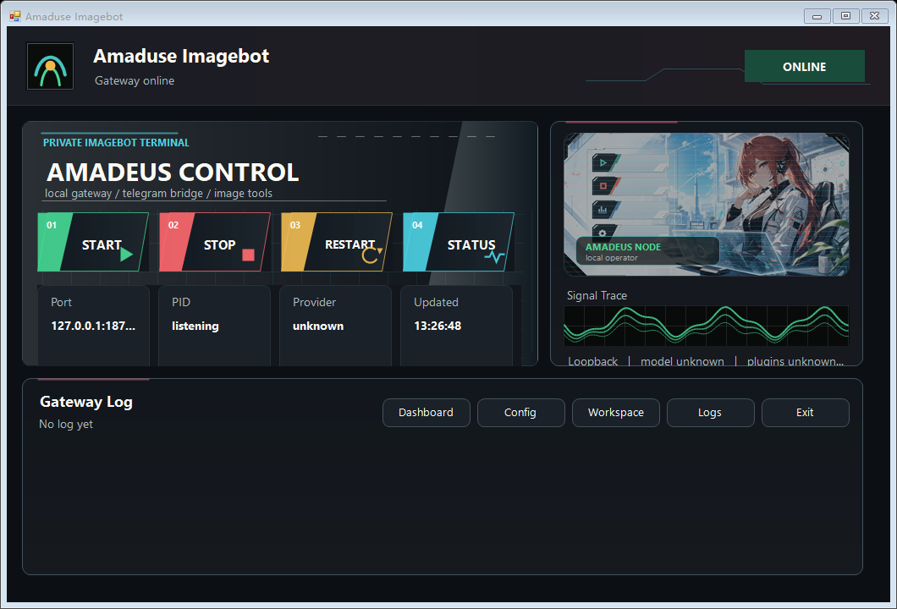
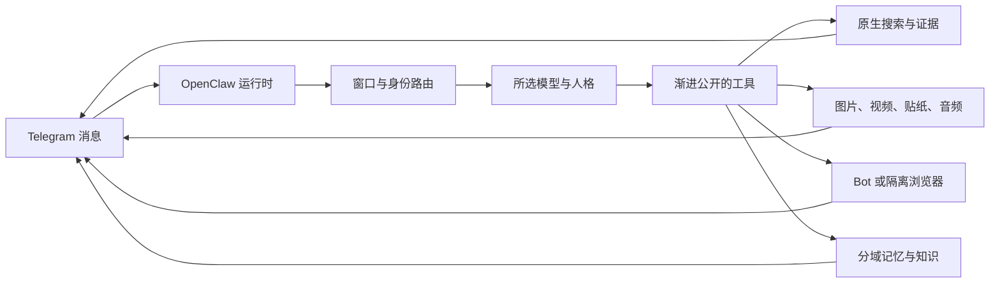

<div align="center">

# Amadeus OpenClaw Lab

**一个面向 OpenClaw 兼容、多模态工具、记忆与媒体工作流的本地优先 Telegram Imagebot 实验室。**

**简体中文** | [English](README.md)

[](https://github.com/HayOMO/amadeus-openclaw-lab/actions/workflows/ci.yml)
[](LICENSE)
[](.nvmrc)
[](docs/PATCH_COMPATIBILITY.md)
[](docs/LOCAL_OPERATOR_GUIDE.md)



</div>

> [!IMPORTANT]
> 这是一个**非官方的个人集成实验室**，不是 OpenClaw 发行版，也不是托管 Bot 服务。项目固定适配一个 OpenClaw 版本，使用者需要自行提供本地凭据。

## 这是什么

Amadeus 把受治理的 OpenClaw 兼容层和插件优先的 Agent 工具层组合在一起。它服务于一个真实的 Telegram 群聊 Bot，但公开仓库只保留可复现的代码、模板、测试和文档。

- **模型路由：**从 Codex 后端发现 GPT 模型目录，支持按窗口切换模型、多模态能力标记，以及 DeepSeek 回退链路。
- **搜索与证据：**默认优先模型原生 Web Search；需要时读取图片搜索结果，再使用 Pixiv、Danbooru、反搜等精确出处工具；只有页面交互确有必要时才升级到浏览器。
- **媒体工作流：**图片生成与编辑、贴纸/GIF 转 WebM、视频观察、语音转写，以及受大小和时长限制的公开视频下载。
- **记忆：**按用户、群组和窗口隔离的记忆，混合检索、受控提示词注入，以及独立的高推理记忆整理路径。
- **Telegram 运行时：**按发送者划分对话窗口、回复连续性、用户模型/人格持久化、有限进度提示和确定性控制命令。
- **浏览器边界：**Bot 专用登录态 Profile，加上一个处理高风险网站的隔离 Profile；用户日常浏览器不在工具权限范围内。

## 架构



仓库刻意维持两个清晰的所有权层：

| 层 | 主要路径 | 规则 |
| --- | --- | --- |
| OpenClaw 兼容层 | `patches/`、`policy/runtime_patch_contract.json` | 只有无法通过公开插件或配置接口安全实现的宿主行为才允许打补丁；每个补丁都必须有验证和退出条件。 |
| Agent 工具层 | `plugins/`、`tool_manuals/`、`features/`、`config/imagebot/` | 产品行为、工具契约、记忆、搜索、媒体和交互策略放在这里。 |

## 快速开始

### 环境要求

- Windows 11 或 Windows Server
- Node.js 24（见 `.nvmrc`）
- 完整测试需要 Python 3.13
- OpenClaw `2026.6.10`
- 按需准备自己的 Telegram、OpenAI、DeepSeek 和资源站凭据

### 安装与验证

```powershell
npm ci
npm run setup:plugins
npm run setup:media
npm run verify:media
npm run build:config
npm run lint:config
```

应用固定版本的兼容补丁，然后启动网关：

```powershell
powershell -ExecutionPolicy Bypass -File .\scripts\APPLY_RUNTIME_PATCHES.ps1
.\START_IMAGEBOT_GATEWAY.cmd
```

网关默认只监听 `127.0.0.1:18789`。模型仅在真实请求到来时唤醒；浏览器和记忆运行时可以独立预热。

## 验证流程

GitHub 工作流与本地 Windows 验证流程保持一致：

```powershell
npm ci
python -m pip install -r requirements-test.txt
.\scripts\INSTALL_IMAGEBOT_PLUGIN_DEPS.ps1 -Force
npm run setup:media
npm run verify:media
npm run audit:plugins
npm run prepare:runtime:ci
npm run lint:config
npm run health:features
npm run test:all
npm run test:patches
```

CI 还会运行 Gitleaks 和 TruffleHog。GitHub Actions 只有仓库只读权限，不会部署或实际运行 Bot。

## 仓库地图

| 路径 | 用途 |
| --- | --- |
| `plugins/` | Agent 工具、记忆、搜索、媒体、浏览器策略和功能运行时 |
| `patches/openclaw-2026.6.10-runtime/` | 固定 OpenClaw 版本的兼容补丁 |
| `tool_manuals/` | 渐进公开的工具使用说明 |
| `config/imagebot/` | 可复现配置与基础提示词来源 |
| `features/` | 清单驱动的确定性功能 |
| `policy/` | 可机器检查的架构与补丁契约 |
| `scripts/` | 安装、验证、迁移、诊断和测试脚本 |
| `docs/` | 架构、安全、存储、决策和运维文档 |

建议先阅读[仓库地图](docs/REPO_MAP.md)、[架构说明](docs/IMAGEBOT_ARCHITECTURE.md)、[Agent 架构对齐](docs/AGENT_ARCHITECTURE_ALIGNMENT.md)和[本地运维指南](docs/LOCAL_OPERATOR_GUIDE.md)。

## 安全与公开边界

公开导出会排除或脱敏：

- Bot Token 和 API 凭据；
- Telegram 群组与操作员 ID；
- 会话、日志、记忆和生成媒体；
- 本机运行状态与编译产物；
- 用户浏览器数据以及 Bot Profile 中的实际登录内容。

改造本项目之前，请阅读[安全策略](SECURITY.md)、[数据存储说明](docs/IMAGEBOT_DATA_STORAGE.md)和[公开仓库计划](docs/PUBLIC_REPO_PLAN.md)。

## 运行时兼容性

当前补丁固定适配 **OpenClaw 2026.6.10**。没有重新导出并验证补丁集时，不支持直接升级 OpenClaw。

```powershell
powershell -ExecutionPolicy Bypass -File .\scripts\VERIFY_RUNTIME_PATCHES.ps1
```

补丁所有权和退出条件见[补丁兼容说明](docs/PATCH_COMPATIBILITY.md)与[运行时补丁契约](policy/runtime_patch_contract.json)。

## 参与贡献

提交改动前请阅读 [CONTRIBUTING.md](CONTRIBUTING.md)。新增行为应优先使用稳定的 OpenClaw API 和项目插件，而不是继续扩大运行时补丁；所有公开改动都必须通过完整本地 CI 与秘密扫描。

## 许可证与署名

项目使用 [MIT License](LICENSE)。第三方参考与设计来源记录在 [NOTICE](NOTICE) 和[署名与参考](docs/ATTRIBUTION_AND_REFERENCES.md)中。
